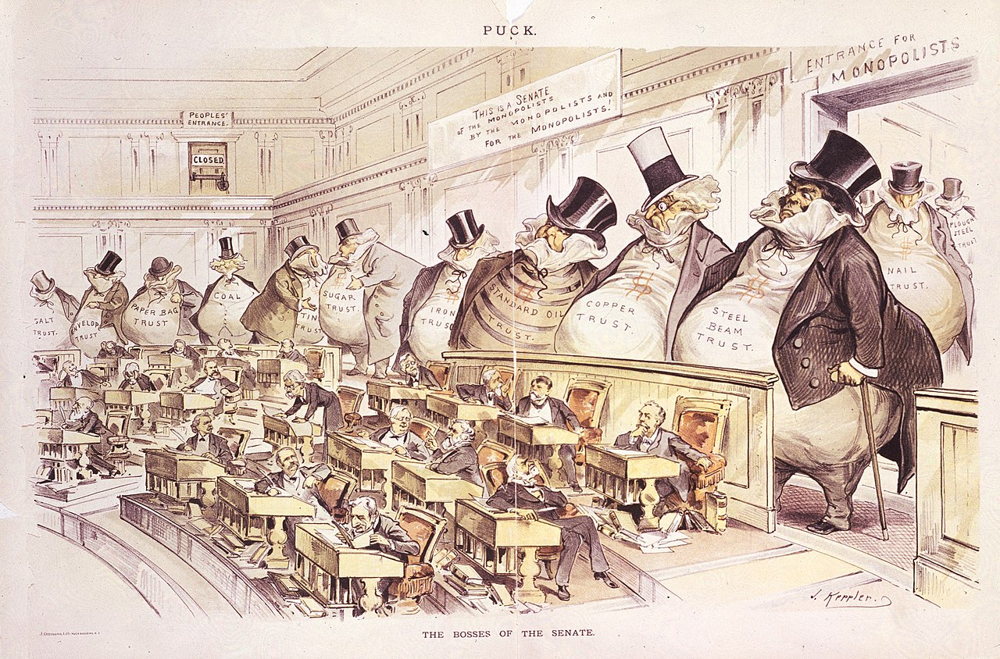

<figure id="historical-cartoon-container">
  
  <figcaption class="cartoon-caption"><em>The Bosses of the Senate</em> by Joseph Keppler (1889). Public Domain.</figcaption>
</figure>

I am a Principal Economist at the Board of Governors of the Federal Reserve System and previously served as an economist at the Federal Trade Commission and the Department of Justice Antitrust Division. My work develops quantitative frameworks and open-source tools for merger review under uncertainty, including market definition, merger simulation, model choice, efficiencies, and financial structure.

Much of my recent work applies these tools to banking and regulated markets, where merger review combines antitrust economics, institutional detail, and public policy. Over nearly two decades of public service, I have led economic investigations and supported high-profile litigations across sectors including retail banking, semiconductors, health insurance, cinema and radio advertising, airlines, and parking services.
