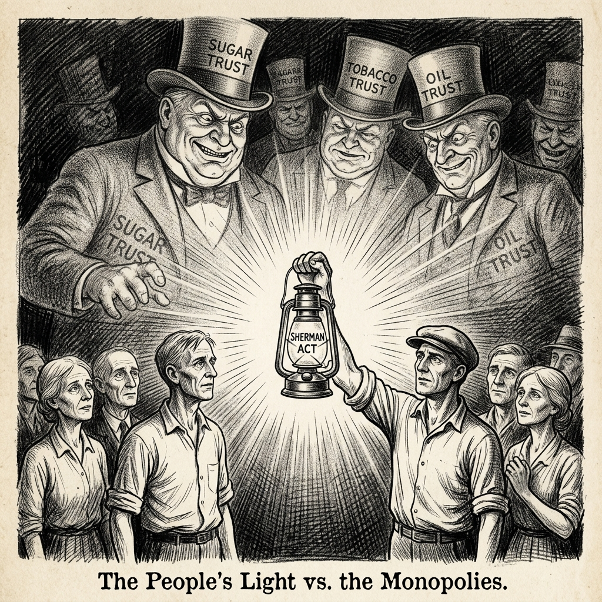

## Charles Taragin

I am a Principal Economist at the Board of Governors of the Federal Reserve System.  I am interested in using economic models to predict the effects of firm conduct and government policies on market outcomes. I have used economic models to predict the outcomes of numerous horizontal mergers in a diverse set of industries, including: financial services, radio and television advertising, and health insurance. I have also used models to analyze the effects of tariffs. 